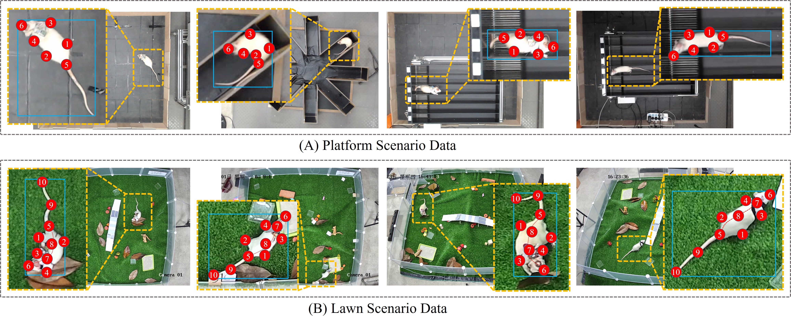

# UDARP-9.4K-Dataset

## Annotations Overview
### Illustration of annotations
<p align="center">

</p>

### Table: Definition of Rat Keypoints

| Keypoint | Definition             | Keypoint | Definition             |
|----------|------------------------|----------|------------------------|
| 1        | Right Hindlimb         | 6        | Head                   |
| 2        | Left Hindlimb          | 7        | Neck                   |
| 3        | Right Forelimb         | 8        | Spine Midpoint         |
| 4        | Left Forelimb          | 9        | Tail Midpoint          |
| 5        | Tail Root              | 10       | Tail Endpoint          | 

### Dataset
```text
UDARP-9.4K
|── UDARP-9.4K
    │── Lawn scenarios
        │-- Tilt_Indoor
        │   │-- 4_train_1_0.jpg
        │   │-- ...
        │-- Vertical_Indoor
        │   │-- 4_0.jpg
        │   │-- ...
        │-- Lawn_scenarios.csv
    │── Platform scenarios
        │-- maze
        │   │-- 1 .bmp
        │   │-- ...
        │-- maze2
        │   │-- maze1_0.jpg
        │   │-- ...
        │-- minefield
        │   │-- 1.bmp
        │   │-- ...
        │-- minefield2
        │   │-- minefield1_0.jpg
        │   │-- ...
        │-- treadmill
        │   │-- 1.bmp
        │   │-- ...
        │-- treadmill2
        │   │-- treadmill1_0.jpg
        │   │-- ...
        │-- Platform_scenarios.csv
```

## License
### If you are interested in our work, please cite the following:

```
@article{han2025cross,
  title={Cross-Domain Animal Pose Estimation with Skeleton Anomaly-Aware Learning},
  author={Han, Le and Chen, Kaixuan and Zhao, Lei and Jiang, Yangbo and Wang, Pengfei and Zheng, Nenggan},
  journal={IEEE Transactions on Circuits and Systems for Video Technology},
  year={2025},
  publisher={IEEE}
}
```
